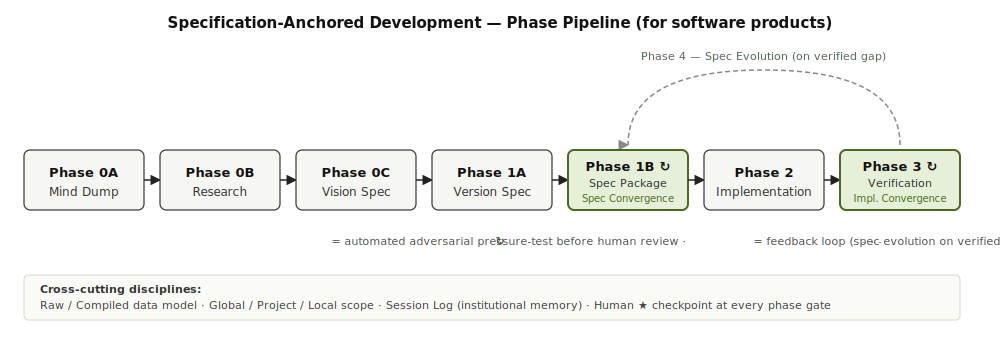

# Specification-Anchored Development (SAD)

*A methodology for AI-assisted software development. Product-pillar, software product type.*

## The problem

Over 50+ iterative steps with an AI agent, even a 1% per-step error becomes catastrophic. Ambiguous specs don't lower that rate — they *expand what "correct" means*, compounding drift invisibly.

## The principle

**Narrow "correct" before any line of code.** A precise spec doesn't raise per-step success; it collapses the interpretive space the agent operates in.

## The pipeline

Seven phases progressively narrow and verify. Gaps surfaced at any phase loop back to the right spec layer — never forward into untested code.

## What keeps it honest

- **Convergence Layer.** Automated adversarial probing at spec-time (ambiguity < 10%) and implementation-time (compliance ≥ 95%), *before* human review. Humans review pressure-tested drafts, not first passes.
- **Two-layer data model.** Raw inputs (ideas, conversations, research) are immutable cold storage; compiled artifacts (specs, session logs) are re-buildable from raw. Context survives AI compaction.
- **Scope levels** map to Claude Code's memory hierarchy: Global, Project, Local.
- **Session discipline.** Every session begins by reading institutional memory; every session ends by writing it.

## Outcome

Buildable specs, not wishful ones. Compounding error collapses into bounded iteration.
